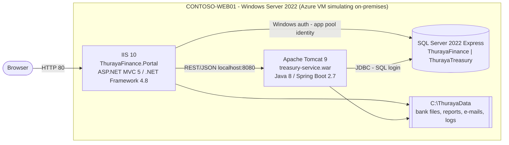

# Group Finance Portal (Al Thuraya Holding) – legacy .NET Framework + Java app for modernization hackathons

The Group Finance Portal is the finance back office of a fictitious Qatari holding company (Al Thuraya Holding, six group entities): approvals under a delegation-of-authority matrix, supplier invoices, payment runs, receivables, treasury and cash forecasting, budgets, vendors, reports and an audit trail – in English and Arabic. It is built the way many customer applications still run today:

- An **ASP.NET MVC 5 portal on .NET Framework 4.8**, hosted in **IIS**.
- A **Java 8 / Spring Boot 2.7 treasury service**, deployed as a WAR file to **Apache Tomcat 9**.
- Two databases on **SQL Server 2022 Express**.

Everything runs together on one Windows Server 2022 VM that plays the customer's on-premises server.

Use it as the "before" state in a hackathon. Participants run **GitHub Copilot modernization** to assess, plan, upgrade, migrate and deploy the app to Azure PaaS – end to end by the GitHub Copilot modernization agent, validated on 5 October 2026 (see [Validated end to end](#validated-end-to-end)).

## What's in this repository

This is the **lab kit** – everything needed to run, rebuild and test the lab:

| Folder / file | What it is |
|---|---|
| [docs/lab/lab-guide.html](docs/lab/lab-guide.html) | **The lab guide** – one page for presenters and participants, step by step (open it in a browser). Keep `images/` and `sample-plans/` next to it. |
| [docs/lab/](docs/lab/README.md) | Presenter reference: the modules 0–4, the [facilitator guide](docs/lab/facilitator-guide.md), 13 screenshots (`images/`) and the two plans Copilot wrote in the validated run (`sample-plans/`) |
| `src/`, `database/` | The application: .NET Framework 4.8 portal, Java 8 treasury service, SQL scripts and the demo-data generator |
| `scripts/Invoke-SmokeTest.ps1` | End-to-end test (15 checks) – before the migration on the VM, after it on Azure |
| `scripts/Test-LabWorkstation.ps1` | Checks a participant's laptop for the required tools |
| `scripts/Copy-DatabasesToAzureSql.ps1` | Optional: copies the VM's real data to Azure SQL (SqlPackage, Entra token) |
| `onprem-vm/` | Builds, updates and removes the simulated on-premises server on Azure |

Participants don't clone this kit. They clone the application repository [zhshah/AlThuraya-App-Modernization-Lab](https://github.com/zhshah/AlThuraya-App-Modernization-Lab): the same `src/`, `database/` and the two participant scripts, byte-identical to this kit and to the code on the VM, without the lab material. When you change the application here, publish the same change there.

## Test the lab from a fresh clone

```powershell
git clone https://github.com/zhshah/AlThuraya-App-Modernization-LabKit.git
cd AlThuraya-App-Modernization-LabKit
start docs/lab/lab-guide.html          # the guide
```

Then follow the guide:

1. **Part 1 – the lab VM** (presenter, PowerShell 7 + Azure CLI, from this folder): `az login`, check the VM, run the smoke test against it. The lab VM `vm-contoso-web01` (resource group `rg-contoso-onprem-swc`) already exists; rebuild it only if it was removed (`./onprem-vm/Deploy-Lab.ps1 …`, 35–50 minutes). Fresh demo data: `./onprem-vm/Update-LabApp.ps1 -ResourceGroup rg-contoso-onprem-swc -ResetDemoData`.
2. **Parts 2–6 – the participant path**, in a separate folder: clone the application repository, assess with GitHub Copilot modernization, plan (prompt A or B), let Copilot modernize and deploy, then run the same smoke test against Azure.
3. **Clean up:** `az group delete -n rg-finance-team1 --yes --no-wait`, and deallocate the VM between events (Part 7).

## Validated end to end

On **5 October 2026** the whole path ran in VS Code, **end to end by the GitHub Copilot modernization agent** (extension 1.24.0, Claude Opus 5.5), on a clone of the application repository:

| Stage | Result |
|---|---|
| Assessment | Treasury service: 5 findings in a few minutes. Custom Assessment with Security: 14 issues |
| Plans | Two plans – portal 8 tasks, treasury service 7 tasks – each ending with a deployment task |
| Code changes | All 15 tasks succeeded, one commit each: .NET 10, Java 21 / Spring Boot 3.5.16, Azure SQL with managed identities, Blob Storage, Communication Services Email, OpenTelemetry. Portal 28/28 integration tests; treasury 12 unit + 33 integration tests; 29 CVEs fixed |
| Deployment | Copilot wrote the Bicep and a deployment script, created 13 Azure resources, loaded the demo data and deployed both apps |
| Proof | Smoke test 15/15 against Azure; `/health` Healthy |
| Time | About 3¾ hours from plans to live |

The result is shown in the guide (Part 6, *The result*). Details, issues and fixes: [facilitator guide – validation record](docs/lab/facilitator-guide.md#5-validation-record).

## Architecture (current state – "on-premises")



| Component | Technology | Responsibilities |
|---|---|---|
| `src/dotnet/ThurayaFinance.Portal` | ASP.NET MVC 5.2.9, .NET Framework 4.8, ADO.NET, Json.NET, packages.config, IIS | The portal UI (dashboard, approvals, payables, payment runs, receivables, treasury, budget, vendors, reports, audit; English/Arabic). Builds the portal's data from SQL Server and the treasury service. JSON APIs for approvals, invoice holds, budget transfers and audit events (anti-forgery protected). E-mail notifications, `/health` |
| `src/java/treasury-service` | Java 8, Spring Boot 2.7.18 (WAR), Spring Data JPA (`javax.persistence`), mssql-jdbc, Tomcat 9 | Bank accounts and balances, 13-week cash forecast, payment runs with dual-control approval, ISO 20022 `pain.001` bank files, daily cash-position CSV report (scheduled), `/api/status` |
| `database/` | T-SQL scripts, Node.js seed generator | `ThurayaFinance` (entities, cost centres, vendors, customers, invoices with approval chains, receivables, budgets, approvals, budget transfers, audit, notifications) and `ThurayaTreasury` (banks, accounts, balance history, payment runs and instructions, cash forecast) |

**What a user's actions do on the server:**

1. **Approve or reject a supplier invoice**: the portal updates the approval chain in one SQL transaction. An approval routes the invoice to the next approver or releases it for payment; a rejection puts it on hold with the reason in English and Arabic. The portal writes the audit entry and drops an e-mail to the requester into the SMTP pickup folder.
2. **Approve the payment run**: the portal calls the Java service, which locks the run, records the first of two approvals and writes the `pain.001` bank file to `C:\ThurayaData\treasury\bank-files`. The portal then closes the approval and audits it.
3. **Put an invoice on hold / release it**, **submit a budget transfer** (numbered from a SQL sequence), **approve a vendor bank change** or **the pending budget transfer**: each is one SQL transaction plus an audit entry.
4. **Sign-in, document views and CSV exports** are recorded in the audit trail.

### Demonstration data

The data is the synthetic dataset of the stand-alone portal: 6 group entities, 18 cost centres, 42 vendors, 268 supplier invoices, 156 receivables, 9 bank accounts, 11 payment runs, 10 pending approvals and 84 audit entries. All organisations, people, accounts and figures are fictitious.

At deployment the server runs the portal's original generator (`database/seed/data.js`, unchanged) with a pinned Node.js and loads the result into both databases. It then checks that the portal serves exactly that data (parity check, about 14,000 values). Dates are relative to the load day (Qatar working week), so the data always looks current.

Redeployments **keep** the data, including changes made in demos. `-ResetDemoData` reloads it fresh.

## Repository layout

```
src/dotnet/                  ThurayaFinance.sln + ThurayaFinance.Portal (classic .csproj, Web.config, Razor view, assets/)
src/java/treasury-service/   Maven project (pom.xml, Spring Boot WAR, unit tests)
database/                    Idempotent schema scripts and seed scripts for both databases
  seed/                        data.js (the portal's original generator), generate-dataset.js, compare-dataset.js
scripts/Invoke-SmokeTest.ps1 End-to-end test (APIs, page, data, write paths) - reusable after migration
scripts/Test-LabWorkstation.ps1     Participant workstation check
scripts/Copy-DatabasesToAzureSql.ps1 Optional: copy the VM's real data to Azure SQL
docs/lab/                    The lab: lab-guide.html, modules 0-4, facilitator guide, images/, sample-plans/
onprem-vm/                   One-command lab automation (the simulated on-premises server on Azure)
  Deploy-Lab.ps1               Deploy everything: Azure VM + server software + running app, then verify
  Update-LabApp.ps1            Rebuild and redeploy the app on an existing lab VM (-ResetDemoData reloads the data)
  Remove-Lab.ps1               Delete the lab (resource group, soft-deleted Key Vault, saved password)
  LabHelpers.psm1              Shared logic (pre-flight checks, Run Command, health checks)
  server/                      Scripts executed on the VM through Azure Run Command
```

## Deploy, use and destroy the lab

Requirements on the presenter's machine:

- **PowerShell 7** and the **Azure CLI**, signed in with `az login`.
- **Contributor** or **Owner** rights on the subscription.
- No local build tools: both applications are built on the VM.

```powershell
# Deploy (current subscription, Sweden Central, own virtual network) - about 35-50 minutes
./onprem-vm/Deploy-Lab.ps1

# Customer subscription / other region / several labs side by side
./onprem-vm/Deploy-Lab.ps1 -SubscriptionId <id> -Location westeurope -ResourceGroup rg-contoso-lab-fabrikam

# Place the VM in an existing subnet instead (for example the Connectivity Hub lab)
./onprem-vm/Deploy-Lab.ps1 -ResourceGroup rg-contoso-onprem-swc -VnetResourceGroup sweden-central-vnet -VnetName Sweden-vNet -SubnetName default

# Redeploy after source changes (~3-5 minutes) - keeps the demo data
./onprem-vm/Update-LabApp.ps1 -ResourceGroup rg-contoso-lab

# Reset the demo data (e.g. before the next customer session)
./onprem-vm/Update-LabApp.ps1 -ResourceGroup rg-contoso-lab -ResetDemoData

# Destroy everything (asks for confirmation; -Force skips it)
./onprem-vm/Remove-Lab.ps1 -ResourceGroup rg-contoso-lab
```

`Deploy-Lab.ps1` runs these phases and ends with the URLs, the RDP command and how to get the VM password:

1. **Pre-flight**: checks sign-in, resource providers, VM sizes and vCPU quota.
2. **Azure resources**: creates the resource group, Key Vault, network and VM.
3. **Server software**: installs IIS, SQL Server Express, JDK 8, Tomcat 9 and the build tools.
4. **Application**: builds both apps on the VM, loads the demo data into empty databases, deploys the apps, then runs the parity check and the smoke test.
5. **Right-size**: shrinks the VM to the demo size and waits until the app is healthy.
6. **Verify**: runs the end-to-end test from your machine through the public URL.

**If it stops anywhere, run the same command again.** Every step is idempotent and continues where it stopped.

| Created in the lab resource group | Details |
|---|---|
| VM `vm-contoso-web01` (`CONTOSO-WEB01`) | Windows Server 2022, **Standard_B2als_v2** (2 vCPU / 4 GiB, ~USD 35/month). Built on a temporary 4-vCPU size, then resized. Windows Update set to manual so it can't reboot during a demo. |
| Software | IIS 10 + ASP.NET 4.8, SQL Server 2022 Express (`.\SQLEXPRESS`, TCP 1433), Temurin JDK 8u504, Tomcat 9.0.98 (service `Tomcat9`, starts after SQL Server), VS 2022 Build Tools, NuGet, Maven, SSMS |
| Network | Own vNet `vnet-contoso-onprem` (10.42.0.0/24), or the existing subnet you pass. Static public IP with DNS name `contoso-onprem-<hash>.<region>.cloudapp.azure.com`. |
| NSG | RDP 3389, HTTP 80 and 8080 **only from the deploying machine's public IP**. Pass `-AllowedSourceIp` for other IPs or CIDR ranges. |
| Key Vault `kv-contoso-onprem-<hash>` | VM admin password. Also saved, encrypted (DPAPI), in `~/.contoso-lab/` on the deploying machine. |
| Tags | `SecurityControl=Ignore` plus workload tags on every resource |

### Built-in safeguards (lessons learned)

- **Pinned installers:** exact versions, verified by SHA-256/SHA-512 or Microsoft signature, downloaded with retries. The SQL Server link is pinned to 2022 because the generic link now serves 2025. The data generator uses a portable, SHA-256-verified Node.js under `C:\ContosoSetup\tools` (not installed system-wide).
- **Verified data:** after loading, the deployment compares what the portal serves with the generated dataset and stops on any difference. The smoke test's write checks only send requests the server must refuse, so it never changes the demo data.
- **No storage account or blob RBAC:** the source is shipped inside the Run Command script itself (tested up to 1 MB).
- **Pre-flight capacity check:** falls back to other VM sizes when a size isn't offered or vCPU quota is short.
- **Repeatable names:** derived from subscription + resource group. A soft-deleted Key Vault is recovered, and `Remove-Lab.ps1` purges it, so the same lab can be redeployed right away.
- **Contributor is enough:** Key Vault uses access policies, so no role-assignment rights are needed. If Key Vault is blocked by policy, the password stays only on the deploying machine.
- **Safe re-runs:** Run Command retries while the VM agent is busy, and a stopped VM is started automatically.
- **Correct file permissions:** the Tomcat config file gets a folder-inherited ACL, so the service can read it.
- **Healthy start after a reboot or resize:** Tomcat depends on SQL Server. The health step restarts Tomcat if the WAR failed during SQL recovery, then warms up the portal.
- **Replaces the earlier Contoso Retail sample:** on a VM that still runs it, the deployment removes its IIS site and Tomcat web app. Its databases (`ContosoRetail`, `ContosoInventory`) are left untouched.

### Troubleshooting

| Symptom | Fix |
|---|---|
| `DEPLOYMENT STOPPED: ...` | Fix the reported cause (e.g. quota, policy) and run the same command again. Full log: `onprem-vm/logs/`. Logs on the VM: `C:\ContosoSetup\logs`. |
| Portal not reachable from your laptop, but the deployment says healthy | Your outbound IP changed or differs. Re-run `Deploy-Lab.ps1 -AllowedSourceIp <ip>`; it only updates the NSG. |
| HTTP 500/503 right after starting the VM | SQL Server and Tomcat need 3-5 minutes on the burstable VM. `Update-LabApp.ps1` waits for health automatically. |
| Token / Conditional Access errors | `az login --tenant <tenant-id>`, then re-run. |
| Lost the VM password | `az vm user update -g <rg> -n vm-contoso-web01 -u contosoadmin -p <new-password>` |

To show the portal to the audience during an event, add an NSG rule for port 80 from the venue IP.

## Demo walkthrough (before modernization)

1. Open `http://<vm-fqdn>/`. After the (simulated) single sign-on splash, the **Group dashboard** shows revenue vs budget, cash by bank (from the Java service), entity performance and the items waiting for you. **About** in the user menu shows the platform: server, IIS, .NET Framework 4.8, SQL Server Express, and the Java / Spring Boot / Tomcat versions of the treasury service. Switch to **عربي** for the Arabic right-to-left UI.
2. **My approvals**: approve a supplier invoice; it routes to the next approver or is released for payment. Reject another with a reason; it goes on hold with the reason in both languages. **Reload the page**: the decisions are stored in `ThurayaFinance`, the **Audit trail** lists them, and the e-mails to the requesters are in `C:\ThurayaData\portal\mail-pickup`.
3. **Payment runs**: approve the run awaiting release (first of two approvals). The Java service records the decision in `ThurayaTreasury` and writes the ISO 20022 bank file to `C:\ThurayaData\treasury\bank-files`. The run then waits for release by Treasury.
4. **Accounts payable**: open an approved invoice and use **Put on hold** / **Release hold**. **View** the invoice document; the view is audited.
5. **Budget control → New transfer**: the request gets the next number from a SQL sequence (`BT-<year>-032`, ...) and appears under *Budget transfer requests*. Approve the pending transfer in **My approvals** to see its status change.
6. **Treasury & cash** shows balances per bank, deposits and the 13-week cash forecast from the Java service. **Reports** download CSV files; every export is audited.
7. `http://<vm-fqdn>:8080/treasury-service/` shows the Java service status page (Java 8, Spring Boot 2.7, Tomcat 9, database).
8. RDP to the VM and show:
   - IIS Manager (site `ThurayaFinance`) and the `Tomcat9` service,
   - SSMS with both databases, for example `SELECT TOP 10 * FROM ThurayaFinance.dbo.audit_log ORDER BY event_at DESC`,
   - the files under `C:\ThurayaData`.

To start the next session with fresh data, run `Update-LabApp.ps1 -ResetDemoData`.

## Hackathon flow with GitHub Copilot modernization

**Run the lab from [docs/lab/lab-guide.html](docs/lab/lab-guide.html)** – one page, one path, for presenters and participants. The Markdown modules in [docs/lab](docs/lab/README.md) are the presenter reference. Facilitators: start with the [facilitator guide](docs/lab/facilitator-guide.md).

Participants clone the application repository [zhshah/AlThuraya-App-Modernization-Lab](https://github.com/zhshah/AlThuraya-App-Modernization-Lab). The VM stays the running "current production". In VS Code, with the GitHub Copilot modernization extension and the `modernize` agent:

1. **Assess** the code (QuickStart → *Migrate to Azure*) and read the report.
2. **Decide** with the customer, then ask for the plans with prompt A (only what Azure needs) or B (all findings, security included). Each plan ends with a deployment task.
3. **Modernize and deploy:** one message runs both plans – .NET Framework 4.8 → .NET 10, Java 8 → 21 and Spring Boot 3, Azure SQL with managed identities, Blob Storage, Communication Services Email, Application Insights, CVE fixes, tests – then Copilot creates the Azure resources and deploys both apps. Progress is visible in `.github/modernize`.
4. **Test on Azure:** `scripts/Invoke-SmokeTest.ps1 -PortalUrl <url> -TreasuryUrl <url>` proves the app still behaves the same.

Participants need Git, VS Code with the GitHub Copilot modernization extension, a GitHub Copilot license, the .NET 10 SDK, the Visual Studio Build Tools (for the .NET assessment), Node.js, the Azure CLI and an Azure resource group with Owner rights. Copilot installs JDK 21 and Maven itself. `scripts/Test-LabWorkstation.ps1` checks the laptop.

### What the assessment should surface (facilitator notes)

| Legacy characteristic | Where | Typical modernization |
|---|---|---|
| .NET Framework 4.8, `System.Web`, MVC 5, `Global.asax`, `packages.config`, classic `.csproj` | `src/dotnet` | .NET 8/10 + ASP.NET Core, SDK-style project |
| Java 8, Spring Boot 2.7, `javax.*`, WAR on external Tomcat, config location set in `catalina.properties` | `src/java/treasury-service` | Java 21, Spring Boot 3 (`jakarta.*`), executable JAR or container |
| SQL Server on the same host; Windows auth via the IIS app pool identity | `Web.config` | Azure SQL Database with Managed Identity (Entra auth) |
| SQL user/password in `application.properties`, `trustServerCertificate=true` | treasury service config | Managed Identity / Key Vault, encrypted connections |
| Bank files and CSV reports written to local disk | `BankFileWriter`, `CashPositionReportService` | Azure Blob Storage (or an SFTP/API integration with the bank) |
| SMTP e-mail through a pickup folder (`system.net/mailSettings`) | `EmailNotifier`, `Web.config` | Azure Communication Services Email |
| Windows Event Log + local log files | `PortalLog`, `logging.file.name` | Application Insights / Azure Monitor |
| Hard-coded `localhost` service URL | `Web.config` `TreasuryServiceUrl` | App settings / service discovery |
| Scheduled job inside the web app | `DailyCashPositionJob` | Container Apps job / Functions timer |
| No real sign-in: a fixed user (simulated SSO) and anonymous IIS access | `app.js`, persona in `app_setting` | Entra ID sign-in (Easy Auth or Microsoft.Identity.Web), real user identity in the audit trail |
| Unauthenticated REST API between portal and treasury service (relies on network isolation only) | `TreasuryServiceClient`, `/api/*` | Entra ID app-to-app auth with Managed Identity, private networking |
| A payment-run approval spans both databases through a synchronous REST call (Java first, then the portal's approval record; a retry is accepted as idempotent) | `ApprovalService` | Keep it idempotent, or switch to events (Service Bus) / an outbox |

## Local development (optional)

- **Databases**: on SQL Server Express (`.\SQLEXPRESS`), run `database/00-create-databases.sql` and both `01-schema.sql` scripts. Generate the data with `node database/seed/generate-dataset.js dataset.json`, then run both `02-seed.sql` scripts with the file's content as the `@data` parameter (as `onprem-vm/server/Deploy-FinancePortal.ps1` does).
- **Java**: install JDK 8+ and Maven. Run `mvn spring-boot:run -Dspring-boot.run.arguments=--server.servlet.context-path=/treasury-service` in `src/java/treasury-service` (port 8080). Create the SQL login `thuraya_treasury` with the password from `application.properties`, or override `spring.datasource.*`.
- **.NET**: open `src/dotnet/ThurayaFinance.sln` in Visual Studio with the ASP.NET workload and run it with IIS Express. Your Windows account needs access to `ThurayaFinance`. The UI is in `assets/` (`app.js`, `i18n.js`, `app.css`): the stand-alone portal's UI, with its data and actions wired to the server.

## Cost and cleanup

Standard_B2als_v2 Windows costs about USD 35 per month, plus a Standard SSD OS disk, a public IP and a negligible Key Vault.

```powershell
az vm deallocate -g rg-contoso-lab -n vm-contoso-web01   # stop compute billing between sessions
az vm start      -g rg-contoso-lab -n vm-contoso-web01   # or simply run Update-LabApp.ps1, which starts the VM
./onprem-vm/Remove-Lab.ps1 -ResourceGroup rg-contoso-lab  # delete everything after the customer session
```
