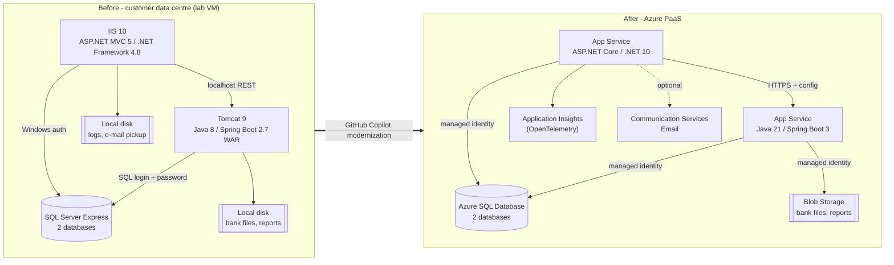

# Hackathon lab: modernize a legacy .NET Framework + Java app with GitHub Copilot modernization

**Scenario.** Al Thuraya Holding runs its **Group Finance Portal** on a Windows server in its own data centre: an ASP.NET MVC 5 portal on **.NET Framework 4.8** (IIS), a **Java 8 / Spring Boot 2.7** treasury service (Tomcat 9) and two **SQL Server** databases. The CFO wants it on **Azure PaaS** – without a rewrite project.

**Your mission.** As the customer's application team, use **GitHub Copilot modernization** to:

1. **Assess** the code and present the findings.
2. **Decide** with the customer whether to migrate.
3. **Modernize** the code: upgrade the runtimes and replace on-premises dependencies with Azure services.
4. **Deploy** the app to Azure App Service and Azure SQL Database.
5. **Prove** the migrated app behaves like the original.

> GitHub Copilot modernization does it end to end – assessment, plans, code changes, tests, the Azure resources and the deployment. You review, decide and approve – *humans stay in the loop at every step*.

**Run the lab from [lab-guide.html](lab-guide.html)** – open it in a browser. It is the one guide for participants and presenters: one path, step by step, with copy buttons, progress ticks and your own values filled into every command. The Markdown pages below are the detailed reference for presenters, including optional alternatives such as the Modernize CLI. Everything – guide, lab scripts and application – is in the lab-kit repository [zhshah/AlThuraya-App-Modernization-LabKit](https://github.com/zhshah/AlThuraya-App-Modernization-LabKit); participants clone only the application, [zhshah/AlThuraya-App-Modernization-Lab](https://github.com/zhshah/AlThuraya-App-Modernization-Lab).

## Before → after

## Tools you use

| Tool | Where | Used for |
|---|---|---|
| **GitHub Copilot modernization** (VS Code extension) | Activity bar → *GitHub Copilot modernization*; Copilot Chat agent **`modernize`** | Assessment report, modernization plans, Azure migration tasks, deployment |
| **GitHub Copilot upgrade** (VS Code extension) | Copilot Chat agent **`@upgrade`** | .NET Framework 4.8 → .NET 10 (guided, with its own assessment, options and plan) |
| **Modernize CLI** (`modernize`, preview) – optional | Terminal | The same assess → plan → execute flow from the command line, for many repositories at once |

## Agenda (about 5¾ hours with intro and read-out)

| Module | Time | You will |
|---|---|---|
| [0 – Set up your workstation](00-setup.md) | 30 min (do it before the event) | Install tools, run `scripts/Test-LabWorkstation.ps1`, get the code |
| [1 – Assess the application](01-assess.md) | 30 min | Tour the running app, run the assessment, read the report |
| [2 – Decide and plan](02-decide-and-plan.md) | 30 min | Present the findings, get the customer's go/no-go, choose the scope, review the plans |
| [3 – Modernize and deploy](03-modernize.md) | about 3¾ hours | Upgrade .NET and Java, migrate to Azure services and deploy to Azure – all by Copilot; follow the progress |
| [4 – Test on Azure](04-deploy-and-verify.md) | 20 min | Prove the apps on Azure behave like the originals; clean up |

**Facilitators:** read the [facilitator guide](facilitator-guide.md) first – it covers the lab environment, the demo script and what was validated.

## Ground rules

- **Let Copilot do the work.** Don't edit code by hand unless Copilot asks you to. The goal is to see what the tools do.
- **Review every phase.** The agents stop between phases. Read what they produced before you approve.
- **Work on a branch.** The agents create branches and commits so every change is reviewable and reversible.
- **AI can be wrong.** If something doesn't build or behaves differently, tell Copilot what you see – that is part of the exercise.
